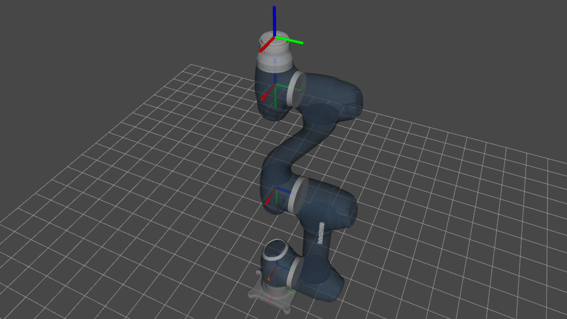
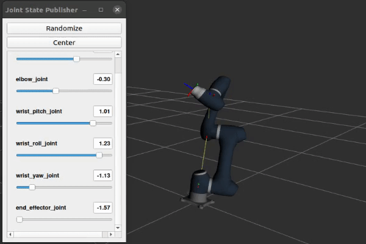

# dsr_a0509_description


<p align="center">
A ROS2 package for the visualisation of the Doosan A0509 robot. <br />


</p>

---

## Setup

In order to run this package, you have to install ROS2. It has been tested on the ROS2 distro Foxy Fitzroy, instructions to install which can be found [here](https://docs.ros.org/en/foxy/Installation.html).

---

## Usage

- Navigate into your `colcon` workspace `cd <colcon-workspace>/src`

- Clone the repository into the `src` directory: 
```sh
$ git clone https://github.com/sampreets3/dsr_a0509_description.git
```
- Navigate back to the root of the workspace, and build using the following command
```sh
$ cd ..
$ colcon build --packages-select dsr_a0509_description --symlink-install
```

---

# Joint Control

Currently, you can use the `joint_state_controller_gui` to control each joint of the robot individually.

Once you have built the package, you can use the launch file `display.launch.py` to view the robot and control each joint.

```sh
$ ros2 launch dsr_a0509_description display.launch.py
```

This will start Rviz2 with the robot loaded, and will provide you with a joint controller, which you can use to actuate each joint as shown below.

<p align="center">
	
</p>

---


